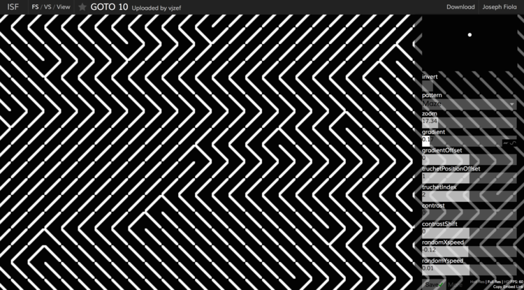
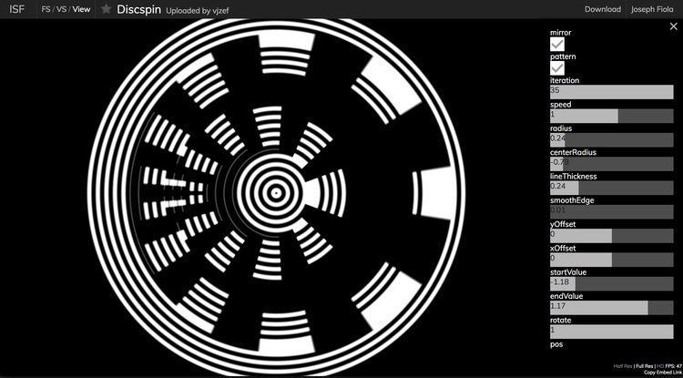
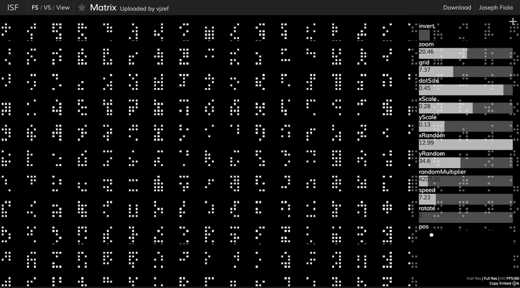

# Saturday Shaders

These are GLSL shaders in the [ISF format](https://vidvox.github.io/isf/), configured to run in [VDMX](https://vidvox.net/) or any other application which supports ISF shader files. With minor adjustments they could be made to work in any application which supports GLSL shaders.

 
## Some examples of Saturday Shaders from the ISF sharing site
  
[Week 15: Goto10](https://www.interactiveshaderformat.com/sketches/696)

    
[Week 23: DiscSpin](https://www.interactiveshaderformat.com/sketches/839)

  
[Week 40: Matrix](https://www.interactiveshaderformat.com/sketches/1219)

---

To read more on Saturday Shaders [see this article on the VDMX website](https://vdmx.vidvox.net/blog/vj-zef-saturday-shaders). 
 
---

[VJ Zef](http://www.joefiola.com/vjzef/) || [Saturdayshaders](www.joefiola.com/saturdayshaders/) || [JoeFiola.com](http://www.joefiola.com/)
